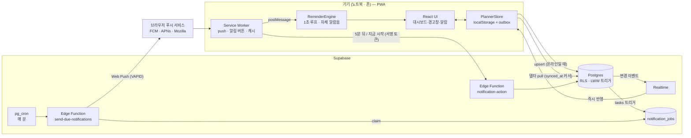
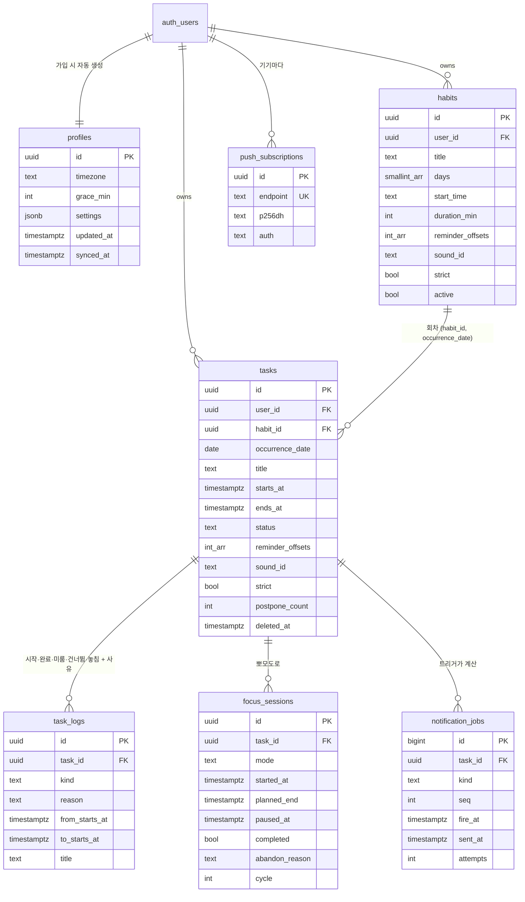
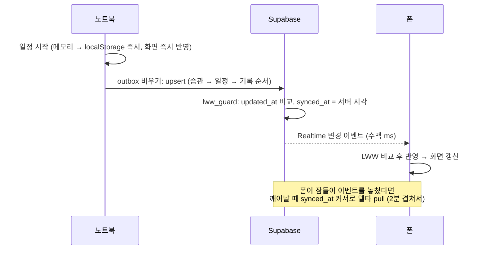

# 구조 — 기술 스택 · DB 스키마 · 동기화 · 알림

## 1. 기술 스택

| 영역 | 선택 | 이유 |
|---|---|---|
| 프론트엔드 | **Next.js 16 (App Router) + React 19 + TypeScript** | 정적 내보내기(`output: "export"`)로 서버 없이 어디든 배포. 서버 일은 전부 Supabase 가 맡는다 |
| 스타일 | **Tailwind CSS v4** + CSS 변수 디자인 토큰 | 다크/라이트를 토큰 하나로 전환. 경고색(빨강)은 미시작 전용으로만 사용 |
| 앱화 | **PWA** — `app/manifest.ts` + 직접 쓴 `public/sw.js` | 홈 화면 설치, Web Push, 오프라인 캐시, 앱 아이콘 배지. 플러그인 없이 동작이 투명함 |
| 백엔드 | **Supabase** (Postgres · Auth · Realtime · Edge Functions · pg_cron · Vault) | DB·로그인·실시간·서버 함수·예약 작업이 한 곳. 무료 플랜으로 개인 사용 충분 |
| 푸시 발송 | Edge Function(Deno) + `web-push` | VAPID 표준 Web Push. Chrome·Edge·Firefox·Safari(macOS 13+, iOS 16.4+ 설치 앱) |
| 소리 | Web Audio API | 녹음 음원(CC0) 재생 + 합성 + 사용자 작곡. 백그라운드 탭에서도 끊기지 않게 미리 예약 |
| 로그인 | 이메일 6자리 코드(OTP) | iPhone 홈 화면 앱은 메일 링크가 Safari 로 열려 세션이 안 이어짐 → 코드 입력 방식 |

## 2. 전체 구조

## 3. 데이터베이스 스키마

전체 SQL: [`supabase/migrations/20261005000000_init.sql`](../supabase/migrations/20261005000000_init.sql)

| 테이블 | 역할 | 규칙 |
|---|---|---|
| `profiles` | 설정(JSON), 시간대, 유예 시간 | 가입 트리거가 생성. 유예를 바꾸면 미시작 경고 시점 재계산 |
| `habits` | 반복 템플릿 | `start_time` 은 현지 'HH:MM'. 서버가 사용자 시간대로 회차 생성 |
| `tasks` | 일정 1건 | `status`: planned → in_progress → done / skipped / missed. `strict` = 강제 모드 |
| `task_logs` | 행동 기록 + **사유(변명 노트)** | **읽기·추가만** — 수정·삭제 권한 자체가 없음 |
| `focus_sessions` | 뽀모도로 | 일시정지는 `paused_at`, 재개 시 `planned_end` 를 밀어서 계산(타이머가 기기마다 같음) |
| `push_subscriptions` | 기기별 Web Push 구독 | 404/410 응답이면 서버가 자동 삭제 |
| `notification_jobs` | 보낼 알림 큐 | 앱은 못 씀. `tasks` 트리거가 만들고 크론이 꺼내 보냄 |

공통 컬럼
- `id` — 클라이언트가 만드는 UUID. 오프라인에서 만들어도 충돌 없음
- `updated_at` — 클라이언트 시계. **`lww_guard` 트리거가 더 오래된 쓰기를 버린다** (오프라인 기기가 늦게 올린 옛 값이 새 값을 덮지 못함)
- `synced_at` — 서버 시계. 클라이언트의 “여기까지 받았다” 커서
- `deleted_at` — soft delete. 삭제도 Realtime 으로 그대로 전파

습관 회차 id 는 `habit_id 앞 24자리 + YYYYMMDD` 로 **결정적**이다. 앱(`habitInstanceId`)과 서버(`materialize_habits`)가 같은 규칙이라 양쪽이 동시에 만들어도 한 행이 된다. 자동 생성 회차의 `updated_at` 은 1970-01-01 이라 사람이 고친 값이 항상 이긴다.

## 4. 동기화 — 로컬 우선

- **쓰기**: 메모리 → localStorage(즉시) → outbox → 온라인이면 업서트. 실패하면 2초→60초 백오프 재시도
- **받기**: Realtime(즉시) + 화면에 돌아올 때·1분마다 델타 pull(놓친 변경 보충)
- **오프라인**: 모든 기능이 그대로 동작. 연결되면 밀린 변경이 순서대로 올라감
- **탭 여러 개**: `storage` 이벤트로 즉시 맞추고, 알람은 Web Locks 로 한 탭에서만 울림

## 5. 알림 — 3중 구조

| 층 | 언제 동작 | 무엇을 | 소리 |
|---|---|---|---|
| ① 앱 안 엔진 (`ReminderEngine`) | 앱(탭)이 열려 있을 때 — 백그라운드 탭 포함 | 1초마다 시점 확인 → 전체화면 알람, 토스트, 진동, 음성, 탭 제목 깜빡임, 배지 | **자체 알람음**(선택한 음원/작곡) — 점점 크게 |
| ② 서버 푸시 | 앱이 완전히 닫혀 있어도 | pg_cron 매 분 → Edge Function → Web Push → 서비스 워커가 시스템 알림 | OS 알림음 (안드로이드는 내보낸 파일로 지정 가능) |
| ③ 서비스 워커 → 앱 | 앱이 열려 있는데 푸시가 도착하면 | 푸시를 앱에 넘겨 ①처럼 알람을 울림 | 자체 알람음 |

①과 ②가 같은 순간에 와도 **tag(`must-<일정>-<종류>-<번호>`)와 키가 같아서 한 번만** 울린다.

| 종류 | 시점 | 비고 |
|---|---|---|
| before | 시작 N분 전 (`reminder_offsets`) | 일정을 만들기 전 시점이면 생략 |
| start | 정각 | 전체화면 알람, “5분 뒤 다시” |
| overdue | 유예 직후, +10분, +25분 | 강제 모드만. 갈수록 문구·소리가 세짐. 세 번째는 끝난 뒤 30분 안까지만 |
| snooze | 누른 뒤 5분 | 잠금화면에서 누르면 서버(`notification-action`)가 직접 예약 |
| end | 진행 중 일정의 끝 | 앱 안에서만 — “완료했나요?” |

앱을 늦게 열어 알림이 여러 개 밀렸으면 가장 급한 하나만 울리고 나머지는 경고창이 하나씩 처리하게 한다.

## 6. 강제 규칙

1. 강제 모드 일정이 시작 + 유예(기본 5분)까지 `planned` 면 → **닫을 수 없는 경고창**
2. 선택지는 셋: 지금 시작 / 미루기(새 시각 + 사유) / 건너뛰기(사유). 이미 끝난 일정이면 다시 잡기 / 놓침 기록
3. 사유는 최소 글자 수(기본 10자) — 모자라면 입력창이 흔들림
4. 시작 시각이 지난 일정을 타임라인에서 끌어 뒤로 옮기는 것도 미루기 → 사유 필요
5. 시작 안 한 강제 일정은 삭제 불가 (경고창에서 사유와 함께 건너뛰어야 함)
6. 건너뛴 일정도 달성률 분모에 남는다
7. 같은 일정을 여러 번 미루면 블록에 “N회 미룸” 딱지 + 압박 문구
8. 집중을 중간에 그만둘 때도 사유

## 7. 보안

- 모든 테이블 RLS — 자기 행만. `task_logs` 는 수정·삭제 권한 회수, `notification_jobs` 는 읽기만
- 크론 → 함수 호출은 `x-cron-secret` 헤더(Vault 에 보관)로 보호
- 알림 버튼(스누즈·시작)은 로그인 없이 동작해야 하므로 **일정 id + 만료시각을 HMAC 서명한 토큰**(6시간)으로 보호
- VAPID 개인키·서비스 롤 키는 Edge Function secrets 에만. 앱에는 공개키와 anon 키뿐
- 로그아웃하면 그 기기의 푸시 구독을 먼저 지움(다른 계정 알림이 오지 않게)
